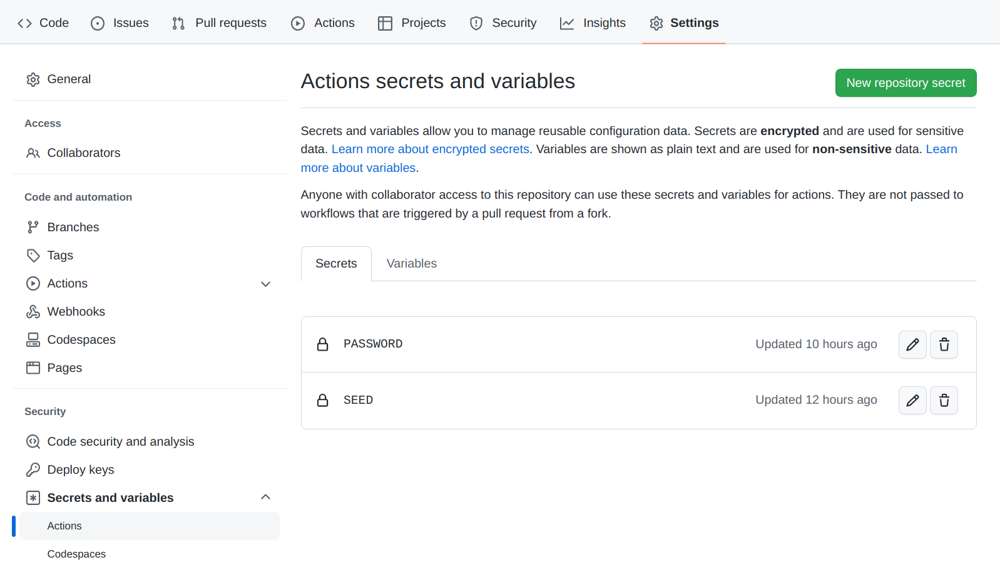

# deploy-me

This repository deploys [deploy.yaml][deploy.yaml] in [Akash Network](https://akash.network) using GitHub Actions workflow.

# How does it work?

# How to use it?

- Fork it.
- Grant workflow write permissions to this repo `Settings` -> `Actions` -> `General` -> `Workflow permissions` -> `Read and write permissions`.
- Get Keplr wallet https://wallet.keplr.app
- Buy some [AKT](https://www.coingecko.com/en/coins/akash-network) tokens on https://app.osmosis.zone (buy OSMO, exchange them to AKT, Withdraw AKT to your Keplr wallet)
- Create two secrets (see below) in your Github repo, under repo `Settings` -> `Secrets and variables` -> `Actions`.
- Top-up your wallet used in the GitHub Actions (20 AKT is enough to start);
- Update [deploy.yaml][deploy.yaml], you can find more examples in the [awesome-akash](https://github.com/akash-network/awesome-akash) repo.

The deployment workflow will run automatically as you push to this repo.
You can also run it manually from the `Actions` tab.

# Secrets

## PASSWORD

The password is used to encrypt your wallet.

NOTE: password must be at least 8 characters long!

## SEED

A mnemonic seed derives a wallet address (Looking like this `akash1wy05zjnfha8zl5fzvgshdyhw89ndkpwdtt3sp7`) and has complete control over that address (issue transactions, send funds, create/close deployments, etc.).

This GitHub Actions workflow will generate a new mnemonic seed named `SEED` if it does not find one. Create it in this repo (`Settings` -> `Secrets and variables` -> `Actions`).

It is up to you to use it, but I suggest you generate it by running Akash client on your local computer. (CLI command: `provider-services keys mnemonic`)
It is a MUST if you use a public repo where everyone can look up your workflow, including the mnemonic seed generated by this workflow.

If you do not have an Akash client, you can install it by following this procedure https://docs.akash.network/guides/cli/detailed-steps/part-1.-install-akash
